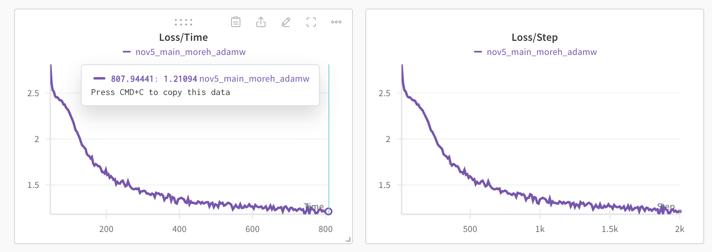

# tt-train: CPP ML training framework


# Key Files for Deep Understanding

To achieve mastery of this codebase, study these files in the following order:

1. `/sources/ttml/core/ttnn_all_includes.hpp`
   - Core header containing essential type definitions and base classes
   - Provides foundation for the entire framework architecture

2. `/sources/ttml/autograd/auto_context.hpp` and `/tests/autograd/autograd_test.cpp`
   - Implements automatic differentiation engine
   - Shows how gradients are computed and tracked
   - Tests demonstrate usage patterns and edge cases

3. `/sources/ttml/ops/binary_ops.hpp` and `/sources/ttml/ops/unary_ops.hpp`
   - Core neural network operations implementation
   - Shows how tensor operations are optimized for Tenstorrent hardware

4. `/sources/examples/nano_gpt/main.cpp`
   - Complete example of model implementation
   - Demonstrates framework usage in production context
   - Shows integration with all major components

5. `/tests/datasets/generators_test.cpp`
   - Examples of data handling and processing
   - Shows test patterns and data validation approaches

6. `/cmake/dependencies.cmake` and `/cmake/compilers.cmake`
   - Build system configuration
   - Shows how dependencies are managed
   - Critical for understanding development setup

7. `/3rd_party/tt-metal/src/hardware_interface.hpp`
   - Hardware abstraction layer interface
   - Critical for understanding hardware optimizations

8. `/sources/ttml/trainer/trainer.hpp`
   - Training loop implementation
   - Shows how all components work together

Note: Start with the tests for each component as they provide practical usage examples and expected behaviors.


https://github.com/tenstorrent/tt-train

# Theoretical Foundation & Architecture Deep-Dive

## Core ML Training Concepts
This framework implements fundamental machine learning training concepts with specific optimizations for Tenstorrent hardware. The key components include:

### Automatic Differentiation Engine
The framework uses reverse-mode automatic differentiation (autograd) to compute gradients. This is implemented in the autograd/ directory, supporting:
- Dynamic computational graphs
- Gradient checkpointing for memory efficiency
- Tensor operations with automatic gradient tracking

### Neural Network Architecture
The core neural network implementation (/sources/ttml/) provides:
- Layer abstractions (Linear, Conv2D, LayerNorm)
- Activation functions (ReLU, GELU, SiLU)
- Loss functions (CrossEntropy, MSE)
- Optimizers (Adam, SGD with momentum)

### Hardware-Specific Optimizations
Tenstorrent-specific features include:
- Tensor core utilization for matrix operations
- Custom memory management for device SRAM
- Pipeline parallelism across tensor processors
- Efficient data movement between host and device

## Framework Components

### Training Loop Architecture
The training loop implementation (/sources/ttml/trainer/) features:
- Automatic batch handling and gradient accumulation
- Mixed-precision training support
- Dynamic learning rate scheduling
- Gradient clipping and normalization

### Data Processing Pipeline
The data pipeline (/sources/ttml/data/) includes:
- Efficient data loading with pre-fetching
- On-the-fly data augmentation
- Custom dataset implementations
- Batching and shuffling mechanisms

### Model Examples
Two primary examples demonstrate the framework's capabilities:

1. MNIST MLP (/sources/examples/mnist_mlp/):
- Implements a basic multi-layer perceptron
- Demonstrates core training loop functionality
- Shows basic data loading and preprocessing

2. NanoGPT (/sources/examples/nano_gpt/):
- Transformer-based architecture
- Causal language modeling
- Demonstrates attention mechanisms
- Shows advanced training techniques

### Performance Optimizations
Key optimizations include:
- Memory pooling for tensor operations
- Kernel fusion for common operation patterns
- Efficient workspace management
- Custom CUDA kernels for critical operations

### Integration Features
The framework provides:
- W&B integration for experiment tracking
- MessagePack serialization for model storage
- CLI11 for command-line argument parsing
- Boost for utility functions

## Development Guidelines

### Code Organization
The codebase follows a modular structure:
- /sources/ttml/: Core ML implementation
- /sources/examples/: Example models
- /tests/: Comprehensive test suite
- /3rd_party/: External dependencies

### Testing Philosophy
The test suite covers:
- Unit tests for individual components
- Integration tests for full training loops
- Performance benchmarks
- Numerical accuracy verification

### Build System
CMake-based build system with:
- Modular dependency management
- Conditional compilation options
- Platform-specific optimizations
- Development and release configurations

## Technical Deep-Dive

### Core Library Implementation (/sources/ttml/)
The core library implements essential ML operations:

#### Autograd System
- Dynamic computation graph tracking
- Reverse-mode automatic differentiation
- Memory-efficient gradient checkpointing
- Custom differentiable operations

#### Neural Network Operations
- Matrix multiplication optimized for Tenstorrent hardware
- Convolution operations with SIMD vectorization
- Layer normalization with numerical stability
- Attention mechanisms with optimized memory access

### Third-Party Integration (/3rd_party/)
Core dependencies and their purposes:

#### tokenizers-cpp
- Fast BPE tokenization
- Vocabulary management
- Token preprocessing
- Efficient string handling

#### tt-metal
- Hardware abstraction layer
- Memory management for Tenstorrent devices
- Custom kernel implementations
- Device-specific optimizations

#### wandb-cpp
- Experiment tracking integration
- Metric logging and visualization
- Model checkpointing
- Hyperparameter management

### Testing Infrastructure (/tests/)
Comprehensive test suite covering:

#### Core Tests
- /tests/autograd/: Gradient computation verification
- /tests/core/: Base operation correctness
- /tests/ops/: Neural network operation tests
- /tests/optimizers/: Optimization algorithm validation

#### Integration Tests
- /tests/model/: End-to-end model testing
- /tests/datasets/: Data loading and processing
- /tests/tokenizers/: Token processing validation
- /tests/ttnn_fixed/: Hardware-specific tests

### Example Models (/sources/examples/)
Reference implementations showcasing framework capabilities:

#### MNIST MLP
- Basic neural network architecture
- Data loading and preprocessing
- Training loop implementation
- Model evaluation

#### NanoGPT Implementation
- Transformer architecture with self-attention
- Token embedding and positional encoding
- Causal language modeling
- Efficient attention patterns

### Build Configuration (CMakeLists.txt)
The root CMakeLists.txt orchestrates:
- Dependency management through CPM.cmake
- Platform-specific compilation flags
- CUDA/CPU conditional compilation
- Test suite configuration

### Utility Scripts
Key automation scripts:

#### build_all.sh
- Configures build environment
- Sets compilation flags
- Manages dependency builds
- Handles platform detection

#### init_repo.sh
- Repository initialization
- Submodule management
- Development environment setup
- Permission configuration

#### init_tt_metal.sh
- Hardware-specific initialization
- Device detection
- Driver configuration
- Runtime optimization

### Development Tools
Configuration for development environments:

#### .clang-format and .clang-tidy
- Consistent code formatting
- Static analysis rules
- Memory leak detection
- Performance optimization hints

#### Pre-commit Hooks (.pre-commit-config.yaml)
- Code formatting verification
- License header checks
- Commit message validation
- Dependency tracking

### GitHub Integration
Workflow automation:

#### GitHub Actions (.github/workflows/)
- Continuous integration pipelines
- Automated testing
- Code quality checks
- Release management

### Code Organization
The source code follows a layered architecture:

#### Core Layer (/sources/ttml/core/)
- Basic tensor operations
- Memory management
- Device abstraction
- Error handling

#### Operations Layer (/sources/ttml/ops/)
- Neural network primitives
- Custom CUDA kernels
- CPU fallbacks
- Operation fusion

#### Model Layer (/sources/ttml/model/)
- Model definition interfaces
- Training loop abstractions
- Loss functions
- Metrics tracking

#### Data Layer (/sources/ttml/data/)
- Dataset abstractions
- Data loading utilities
- Preprocessing pipelines
- Augmentation strategies

## Overview
This repository contains a high-performance training framework developed in C++ designed to efficiently leverage the computational capabilities of Tenstorrent hardware. The framework is optimized to accelerate model training tasks, providing a seamless interface for training deep learning models on Tenstorrent's advanced hardware architecture.

# Install
1. Initialize and update submodules
```
git submodule update --init --recursive
```
2. Install CMake 3.30
3. Run setup script to configure env variables, direnv, clang-tidy and clang-format.
```
source ./init_repo.sh
```
4. Navigate to `tt-metal` folder and follow repository instructions to build it


# Building the project:
You have two options for building the project:

## 1. VSCode
* Install the [CMake](https://marketplace.visualstudio.com/items?itemName=twxs.cmake) and [direnv](https://marketplace.visualstudio.com/items?itemName=mkhl.direnv) extensions for VSCode.
* Use UI to build all targets.

## 2. Terminal
### Debug
```
cmake -DCMAKE_BUILD_TYPE=Debug -B build -GNinja
cmake --build build --config Debug --clean-first
```
### Release
```
cmake -DCMAKE_BUILD_TYPE=Release -B build -GNinja
cmake --build build --config Release --clean-first
```


# Run
## MNIST
### Training
```
# Navigate to the root directory of the repository
./build/sources/examples/mnist_mlp/mnist_mlp --model_path mnist_mlp.msgpack --num_epochs 10
```
### Evaluation
```
# Navigate to the root directory of the repository
./build/sources/examples/mnist_mlp/mnist_mlp --model_path mnist_mlp.msgpack -e 1
```

## NanoGPT Shakespeare
### Training
```
# Navigate to the root directory of the repository
TT_METAL_LOGGER_LEVEL=FATAL ./build/sources/examples/nano_gpt/nano_gpt --model_path nano_gpt.msgpack --data_path sources/examples/nano_gpt/data/shakespeare.txt
```

Training loss example from [wandb project](https://wandb.ai/tenstorrent-ml/tt_train_nano_gpt):



### Evaluation
```
# Navigate to the root directory of the repository
TT_METAL_LOGGER_LEVEL=FATAL ./build/sources/examples/nano_gpt/nano_gpt --model_path nano_gpt.msgpack -e 1 --data_path sources/examples/nano_gpt/data/shakespeare.txt

```

# Contributing
* Create a new branch.
* Make your changes and commit them.
* Add new tests and run existing ones
* Open a pull request (PR).
* Ensure the PR is approved by at least one code owner before merging.
